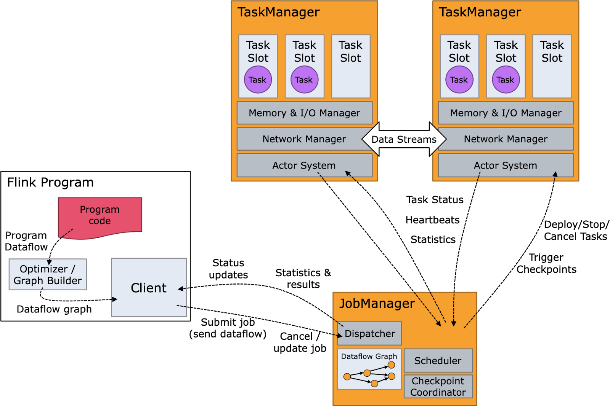
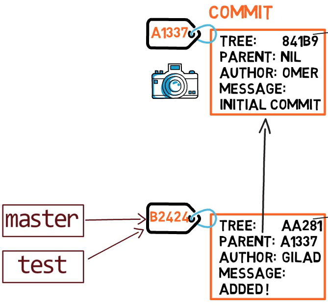
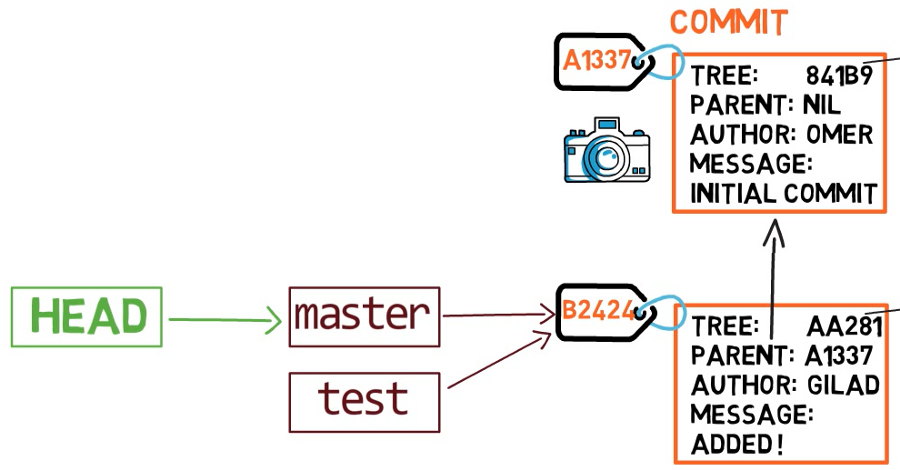
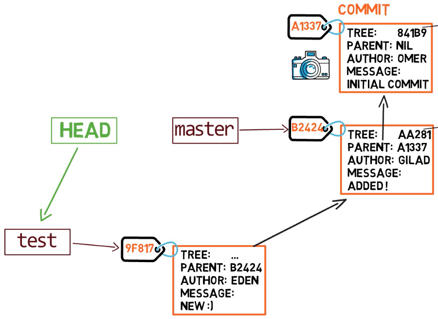

# Flink-Examples

`flink-daemon.sh` 
`jobmanager.sh`
`kubernetes-jobmanager.sh`
`kubernetes-taskmanager.sh`
`pyflink-shell.sh`
`sql-client.sh`
`standalone-job.sh`

`start-cluster.sh`

`start-zookeeper-quorum.sh`
`stor-cluster.sh`
`stop-zookeeper-quorum.sh`
`taskmanager.sh`
`zookeeper.sh`

`yarn-session.sh`

`kubernetes-session.sh`

`flink-console.sh`

`flink`

## Start Flink Web UI
run `start-cluster.sh` and visit `localhost:8081`

You can use `jps` to check all running java processes

## How Flink works
The program code or SQL query is composed into an operator graph which is then submitted by the client to a job manager. The job manager breaks the job into operators which execute as tasks on nodes that are running task managers.

 

## Why Flink? Advantages
Apache Flink is chosen due to its robust architecture and extensive features set. Because it can handle bounded and unbounded streams together, it can unify batch and stream processing under the same umbrella. Its features include sophisticated state management, savepoints and checkpoints, event time processing semantics and exactly once consistency guarantees for state.

infinite streams is broken into measurable time windows in two ways
`stream.windowAll(timeWindow)` is available on a non-keyed stream. this is a stream where you haven't used the `keyBy` operator. The `windowAll` operation is runned by a single task without parallelism
for keyed streams, we use the `window` operation
`stream.keyBy(record->record.key).window(timeWindow)`
`keyBy` operation partitions the stream which allows the `window` operation to be run in parallel
`TumblingEventTimeWindows` breaks the stream into discrete 5 seconds chunks
`SlidindEventTimeWindows.of(windowSize,windowSlide)`

`EventTimeSessionWindows`

The purpose of a watermark is to gurantee that the stream is up to date

`flink run`  command is used to submit a job to the flink cluster

`flink cancel $JOB_ID` the `JOB_ID` is return after submitting it to the cluster

## How git works
`Objects`: Git stores all of its data in objects, which are blobs (file content), trees (directory structures), commits (snapshots of the project at a specific point in time), and tags (labels for specific commits). These objects are identified by a unique hash based on their content.

`Commits`: A commit is a snapshot of the project at a specific point in time. Each commit contains a reference to a tree object, which represents the state of the project's directory structure, and metadata such as the author, timestamp, and a commit message. Commits are linked together in a chain, forming a history.

`Branches`: A branch is simply a lightweight movable pointer to a commit. Creating a new branch doesn't copy the entire project; it just creates a new pointer that can be moved independently of other branches. The branch names are references to specific commits.

`HEAD`: The HEAD is a special pointer that points to the latest commit in the currently checked-out branch. It represents the commit you currently have checked out, and any changes you make will be relative to this commit.

`Index (Staging Area)`: The index is an intermediate area where changes are prepared before committing. It's a snapshot of files as they are in your working directory, but it allows you to choose which changes to include in the next commit.

`Remote Repositories`: Git allows collaboration by supporting remote repositories. Each developer can have their local repository, and changes can be pushed and pulled from remote repositories. Remote repositories are typically hosted on platforms like GitHub, GitLab, or Bitbucket.

`Branching and Merging`: Creating a branch involves creating a new pointer to the current commit. Merging combines two branches into a single branch. Git uses a three-way merge algorithm to reconcile changes.

## Git Objects:
`Blob (file content)`:
Blobs store the contents of files at a particular state. They are uniquely identified by the SHA-1 hash of their content.
`Tree (directory structure)`:
Trees represent the structure of the project at a specific point in time. They contain references to blobs (files) and other trees (subdirectories).
`Commit Object`:
A commit object contains metadata such as the author, committer, commit message, and a reference to the top-level tree that represents the state of the project at the time of the commit.

Git Branching:
Creating a Branch:

When you create a new branch, Git essentially creates a new pointer to the same commit where the branch was created. The new branch initially points to the same commit as the branch it was created from.
Switching Between Branches:

The act of switching between branches updates the HEAD pointer to point to the latest commit on the selected branch. Your working directory is then updated to reflect the state of that commit. 

`HEAD` always points to the most recent commit.It references the current branch's most recent commit.HEAD functions like a pointer that continously tracks the most recent commit in your working branch
.if we switch branches, HEAD automatically moves to the new branch and points to the most recent commit of the respective branch
.HEAD does not point to the commit; instead it points to the branch name where the recent commit has occured and the branch points to the latest commit

Git is a content-addressable filesystem. Great. What does that mean? It means that at the core of Git is a simple key-value data store. What this means is that you can insert any kind of content into a Git repository, for which Git will hand you back a unique key you can use later to retrieve that content.

`.git/objects directory (the object database)`

The subdirectory is named with the first 2 characters of the SHA-1, and the filename is the remaining 38 characters.

Blobs, on the other hand, are just contents — binary streams of data. A blob doesn’t register its creation date, its name, or anything but its contents.

In git, a snapshot is a commit. A commit object includes a pointer to the main tree (the root directory), as well as other meta-data such as the committer, a commit message and the commit time.In most cases, a commit also has one or more parent commits — the previous snapshot(s)

A branch is just a named reference to a commit

So if we create a branch called test, by using git branch test, we are actually creating another pointer that points to the same commit as the branch we are currently on.

How does git know what branch we’re currently on? It keeps a special pointer called HEAD. Usually, HEAD points to a branch, which in turns points to a commit

o switch the active branch to be test, we can use the command git checkout test. Now we can already guess what this command actually does — it just changes HEAD to point to test.

In some cases, HEAD can also point to a commit directly

after commit,Afterwards, the test pointer will move to the newly added commit. Note that HEAD still points to test

Blob
- created during git add
- contains binary data for a file
- contains no metadata on file, not even file name

 git add creates the blob object and git c
 commit creates a tree object and commit object
[Git Internals](https://www.freecodecamp.org/news/git-internals-objects-branches-create-repo/)

Remote repositories are versions of your project that are hosted on the Internet 
`git remote add <shortname> <url>`

`git push <remote> <branch>` to push upstream

`git log --oneline --decorate --graph --all`

## Create a Heroku Remote
Git remotes are versions of your repository that live on other servers. You deploy your app by pushing its code to a special Heroku-hosted remote that’s associated with your app.
### For a new app
`heroku create -a example-app`
You can use the `git remote` command to confirm that a remote named `heroku` has been set for your app

### For an existing app
Add a remote to your local repository with the `heroku git:remote` command. All you need is your Heroku app’s name
`heroku git:remote -a example-app`
### Deploy changes
To deploy your app to Heroku, use the `git push` command to push the code from your local repository’s `main branch` to your `heroku` remote. For example:
`git push heroku main`

Every commit holds a single tree

`git add` creates a blob out of files
a branch is a named reference to a commit
a commit with multiple parents is a merge commit

tree inside commit
blob inside tree
every commit holds a tree and every tree may contain any number of other trees and blobs in its leaves
index refers to the set of newly created trees and blobs which you created by running git add and these new objects will soon get bound into a new tree for the purpose of committing to your repo
The state of the index becomes the tree of the next commit

`origin/main` is a remote-tracking branch present in our local reposirtory that tracks the changes made to the main branch in the remote repository

`git fetch` will fetch changes into current repo and store into `origin/main`

the changes are not in the current `main` yet

to merge, we use `git merge origin/main`

Instead of using a merge commit, rebasing rewrites history by creating new commits for each of the original feature branch commits. It movs the entire feature branch so that it begins at the tip of the mster branch. the context is that there are changes in master that feature does not have and we want to incorporate those chnages into feature
`git switch feature` and `git rebase master`
Take the current branch I am on and base it off of master
Both help to integrate changes from one branch into another
`fast forward merge` where the master branch has not changed but the feature branch has chnaged. We simply switch to master branch( branch to merge into) and  type ` git merge feature_branch` into master branch
not all merges are fast forwars, often there is a change in the master branch  and the feature branch. This means git has to create a new merge commit on master 

`git` creates the folder to reduce the number of files per folder
`tree` solves the issue of not having the file name associated with the blob

` git push REMOTE_NAME BRANCH_NAME` which updates the remote branch with local commits
`git push -u origin main` sets the remote origin as the upstream reference. This allows you to later perform git push and git pull commands without having to specify an origin. `u or --set-upstream`

git is a directed acyclic graph
commits all reference their parents
branches are named pointers to commits

HEAD is a special pointer to the latest commit and automatically moves
Every commit holds the entire  snapshot, not just the diffs from the previous commits
When we do `git commit`, the commit is created based on the state of the index

internally, git calls branches by the name `heads`

`HEAD` is a file whose content describes what it points to
`git write-tree` records the contents oof the index in a tree object

we can use `git commit-tree <tree hash> -m <commit message>` to create a commit object that references this tree

a branch is just a file in `.git/refs/heads` that contains a hash of the commit it refers to

both remotes and heads contain files whose content are hashes of the commit they point to
` git add .` adds all files and folders to the staging area( creates the hashes)
`git commit` then creates a tree based on the contents of the stating area

`.git/objects` directory is called the object store. it is a content-addressable data store, meaning that we can retrieve the contents of an objet by providing a hash of those contents. In this way, the object store is like a database table with two columns: the object Id and the object content. The object Id is the hash of the object content and acts like a primary key

The reference store exists in ` .git/refs/` directory

In the reference store, the reference name is the primary key

An annotated tag contains a reference to another object( by object Id) and a plain-text message. The tags object references a commit object. A commit is a snapshot of the worktree at a point in time, along with connections to previous versions. It contains links to parent commits, a root treee, as well as metadata , such as commit time and commit message

The commit graph is the directed graph whose vertices are the commits in the repository and where a commit has a directed edge to each of its parents

` git fetch` runs on a client repository and tries to synchronize with a remote repository. We get all objects from the remote's branches in `refs/heads/` and we write copies in `refs/remotes/<remote>`
. The first part is called ref advertisement, where the client requests the list of references available on the remote.

you can test the ref advertisement directly using the ` git ls-remote --heads origin` command, which requests the ref advertisement but does not download any new objects
A commit with no parents is a root commit and a commit with multiple parents is a merge commit

we have two types of tags. `lightweight` tag is very much like a branch that does not chnage- it's just a pointer to a specific commit. `Annotated tags` however are stored as full objects in the git database.They're checksummed; contain the tagger name,email and date; have a tagging message; and can be signed and verified with GNU privacy guard. It is generally recommended that you create annotated tags

By default `git push` does not  transfer tags to remot server
`git push origin <tagname>`
`git push origin --tags` will transfer all tags to the remote server
When you clone someone else's repository,it basically just copies the contents of this directory to your  computer

`git diff` compares what is in the working directory and staging area
`git diff --staged` compared staged areas to repo
`git checkout` specify a commit and update your working dir to reflect that commit

`git reset --hard HEAD` throw away everything that is not commited and go back to the latest version of what you are working on(HEAD->branch-latest commit)
.git is the repo

## Sync chnages from the upstream repo

To sync an upstream repo,first, you need to fetch the upstream changes
`git fetch upstream`

Then merge the changes from the upstream branch to the local branch.In this example, it's the main upstream branch
`git merge upstream/main`

When you push a local branch with the upstream command, it automatically creates the remote branch and adds tracking to your local branch
`git push origin foo` will create the remote branch without tracking, meaning when someone pushes any changes to the branch foo in the remote branch and you when you try to pull the changes, it will throw an error
`There is no tracking information for the current branch`

You can also add git upstream using git HEAD

`git push -u origin HEAD` ; HEAD refers to the currently active branch
upstream enables local branches to track the remote branches, hence makes pulling changes from remote repso easy
## Flink

Every Flink program performs transformations on distributed collections of data. A variety of functions for transforming data are provided, including filtering, mapping, joining, grouping, and aggregating
A sink operation in Flink triggers the execution of a stream to produce the desired result of the program, such as saving the result to the file system or printing it to the standard output
Flink transformations are lazy, meaning that they are not executed until a sink operation is invoked
The Apache Flink API supports two modes of operations — batch and real-time. 
